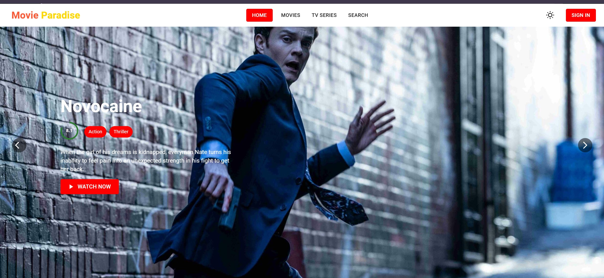
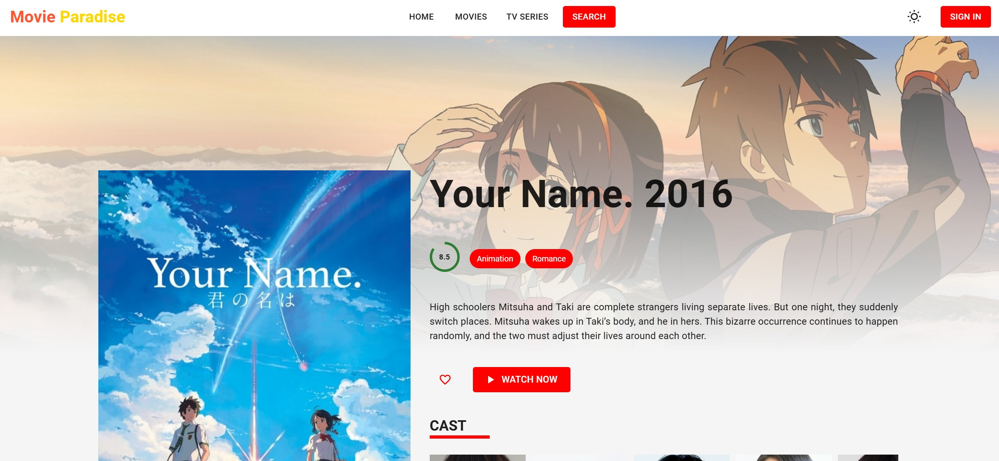
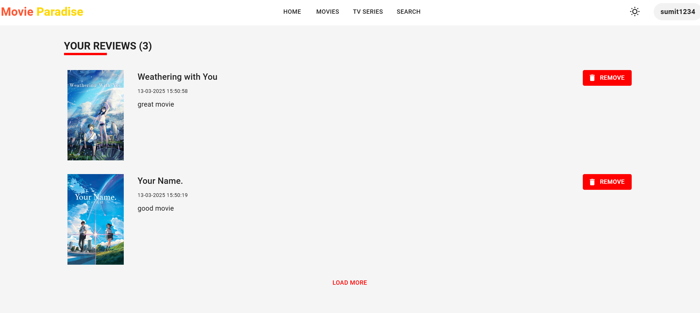
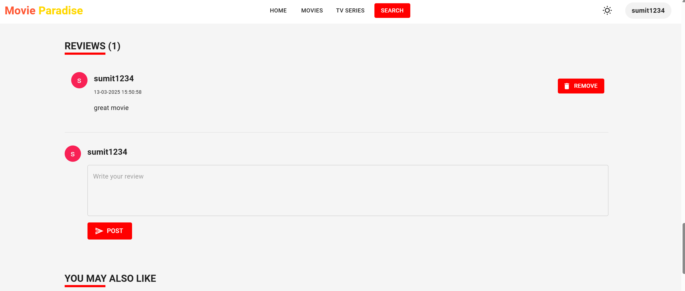
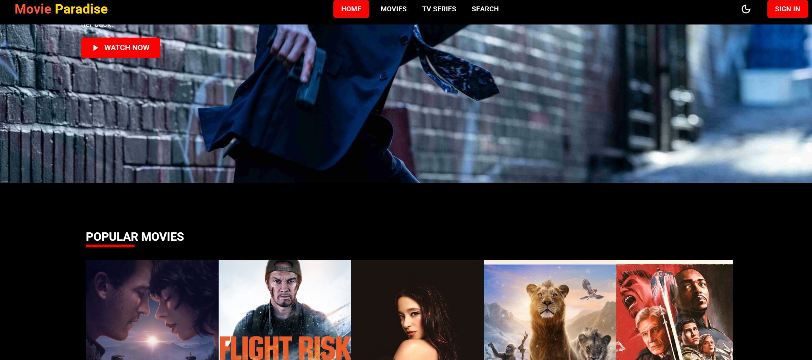
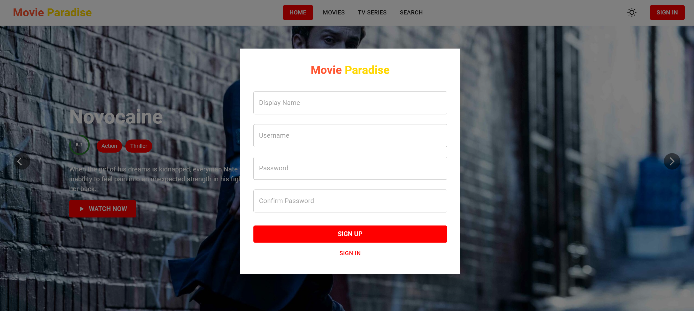

# 🎬 **Movie Paradise** 🍿  

Welcome to **Movie Paradise** – A platform where you can browse the latest movies, manage your favorites, and interact with fellow movie enthusiasts through comments. All movie data is sourced from the **TMDB API** to ensure up-to-date and accurate movie information! 🎥✨  

---

## 🚀 **Features** 🚀  

- **🔐 User Authentication**: Secure sign-up, login, and session management.  
- **🍿 Movie Browsing**: Search, filter, and sort movies to discover new films.  
- **❤️ Favorites Management**: Add/remove movies to your favorites list.  
- **💬 Comments System**: Post, edit, and delete comments on movies.  
- **🌙 Dark Mode**: Enjoy a visually comfortable experience.  
- **📱 Responsive Design**: Works seamlessly on desktop, tablet, and mobile.  

---

## 📸 **Screenshots** 📸  

### 🌟 Light Mode  
  
*Browse and explore your favorite movies!* 🎬  

  
*Get detailed insights into each movie, including cast, ratings, and more!* 🎥  

  
*Read and leave reviews for movies!* ✍️  

  
*See what others have to say!* 👥  

### 🌙 Dark Mode  
  
*Experience a sleek and eye-friendly dark mode!* 🖤  

### 🔐 Authentication Screens  
  
*Log in securely to your account!* 🔑  

  
*Create an account and start exploring movies!* 📝  

  
*Easily update your password for security!* 🔒  

---

## 🛠️ **Technologies Used** 🛠️  

### **Frontend**  
- React.js ⚛️  
- Redux (Optional for state management) 🔄  
- Bootstrap / Material-UI (Optional for styling) 🎨  
- CSS/SCSS ✂️  

### **Backend**  
- Node.js 🚀  
- Express.js ⚡  

### **Database**  
- MongoDB 🗄️ (Mongoose ORM)  

### **Authentication**  
- JWT (JSON Web Tokens) 🔑  
- bcrypt for password hashing 🔒  

### **API Integration**  
- TMDB API 🎥  

### **Version Control & Deployment**  
- Git & GitHub 🧑‍💻  
- (Optional) Heroku / Netlify / Vercel 🌍  

---

## 🔍 **Features to Explore** 🔍  

1. **🔐 User Authentication**  
   - Register, log in, and manage your account securely.  

2. **🍿 Browse Movies**  
   - Search for movies by title, filter by genre, release date, or rating.  

3. **❤️ Favorites Management**  
   - Add/remove movies to/from your favorite list.  

4. **💬 Commenting System**  
   - Post, view, edit, and delete comments on movies.  

5. **🌙 Dark Mode**  
   - Toggle between light and dark themes.  

6. **📱 Responsive Design**  
   - Optimized for any device – desktop, tablet, or mobile!  

---

## 🏁 **Getting Started** 🏁  

### 1️⃣ Clone the Repository  
```bash
git clone https://github.com/your-username/movie-paradise.git
cd movie-paradise
2️⃣ Install Dependencies
Frontend
Navigate to the frontend folder and install dependencies:

bash
Copy
Edit
cd frontend
npm install
Backend
Navigate to the backend folder and install dependencies:

bash
Copy
Edit
cd backend
npm install
3️⃣ Set Up Environment Variables
Create a .env file in the backend folder with the following:

env
Copy
Edit
TMDB_API_KEY=your_tmdb_api_key
JWT_SECRET=your_jwt_secret_key
MONGO_URI=your_mongo_database_url
4️⃣ Start the Application
Run the Backend
bash
Copy
Edit
cd backend
npm start
Run the Frontend
bash
Copy
Edit
cd frontend
npm start
Visit http://localhost:3000 to view the application! 🎉

🙏 Acknowledgements 🙏
TMDB API 🎥 for providing excellent movie data.
React.js ⚛️ for building a dynamic frontend.
Node.js & Express.js 🚀 for backend infrastructure.
MongoDB 🗄️ for the database.
🧑‍💻 Support 🧑‍💻
Have questions? Feel free to open an issue or reach out directly! 📩
We’re here to help and improve together!

🍿 Happy Movie Watching! 🎬
